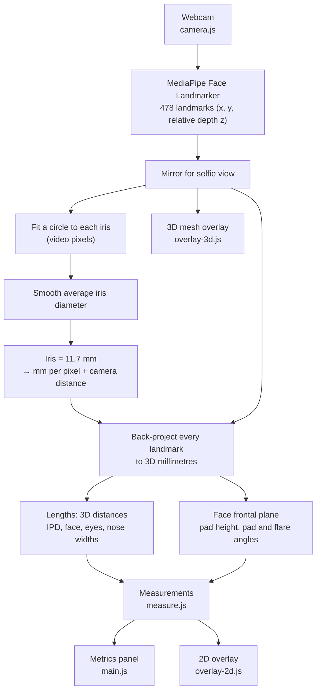

# headSize — Face/Head Measurement Demo

Measures facial dimensions in the browser from a webcam feed using MediaPipe Face Landmarker. Everything runs locally; no video leaves the device.

Demo: https://shameem4.github.io/headSize/ · Article: [Measuring the human face privately in the browser](https://www.linkedin.com/pulse/measuring-human-face-privately-browser-shameem-hameed-51okc/)

## What it measures

- **Camera distance** — from apparent iris size
- **IPD** — pupil to pupil. *Near* is measured while you look at the screen; *far* corrects for your eyes converging on it (≈ +2% at 50 cm).
- **Face width** — landmarks 127 ↔ 356
- **Eye widths** — eye corner to eye corner (33 ↔ 133, 362 ↔ 263)
- **Nose** — bridge width, pad width, pad height, pad angle, flare angle

## How it works



1. The iris is assumed to be 11.7 mm across. Its size in video pixels gives the mm-per-pixel scale at the eyes and, with an assumed ~64° field of view, the distance to the camera.
2. Each landmark is back-projected to 3D millimetres using MediaPipe's relative depth, so points in front of or behind the eyes are scaled correctly and turning or tilting the head doesn't shrink measurements.
3. Lengths are 3D distances; pad height and the angles are taken in the face's frontal plane.

**Accuracy limits:** real irises vary (~11–12.5 mm), which scales every mm value by the same factor. Distance also depends on the field-of-view guess. The depth correction is only as good as MediaPipe's per-landmark depth.

## Views

- **2D Overlay** — measurement rails and labels over the video. Focus radio buttons (Global / Face / Eyes / Nose) pick which measurements are drawn.
- **3D Overlay** — Three.js face mesh, landmark points, and pupil lines aligned to the video, with wireframe, landmark and opacity controls.

## Running locally

No build step. ES modules need a web server:

```bash
python -m http.server 8000
```

Then open http://localhost:8000 and allow camera access. If the camera is blocked, missing, or in use, the page says so.

## Files

```text
index.html, style.css      UI
main.js                    Metrics panel, controls, canvas sizing, render loop
config.js                  Landmark indices, smoothing, colors, overlay layout
camera.js                  Webcam selection, landmark mirroring, MediaPipe setup
measure.js                 Iris fit, mm scale, distance, 3D back-projection, metrics
overlay-2d.js              2D rails, labels and nose overlays (focus modes)
overlay-3d.js              Three.js mesh, landmark points and pupil lines
face-mesh-triangles.js     Mesh triangulation (from face_model_with_iris.obj)
face_model_with_iris.obj   MediaPipe canonical face model with iris (reference data)
```

## History

The earlier React/Vite version is preserved in the `archive/main-vite` tag.

## License

MIT, see [LICENSE](LICENSE).
